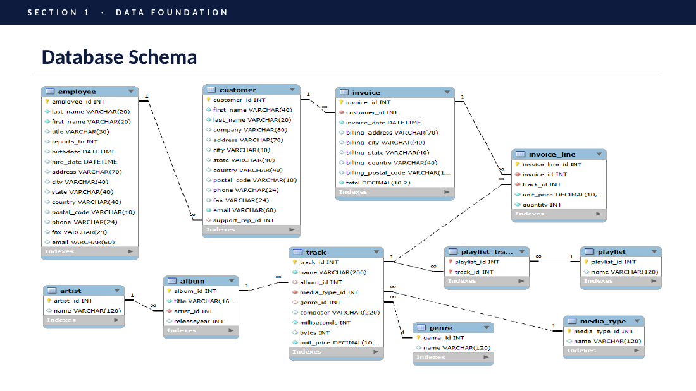
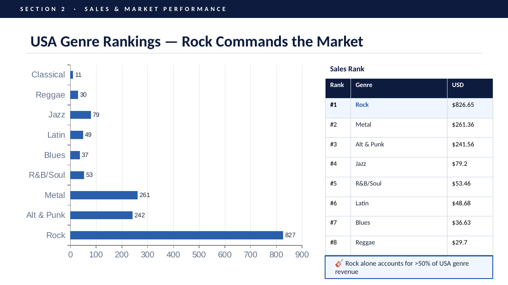
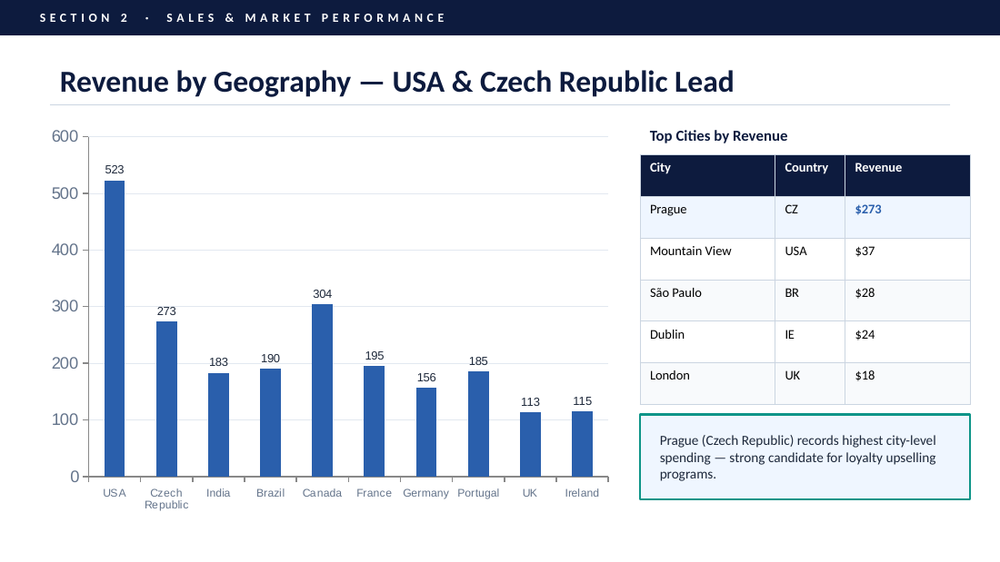
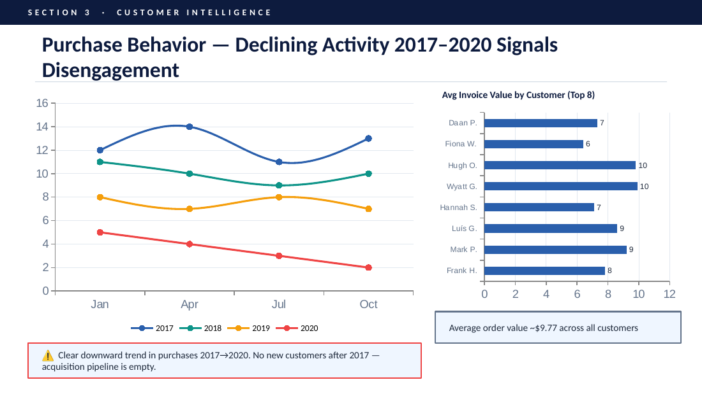
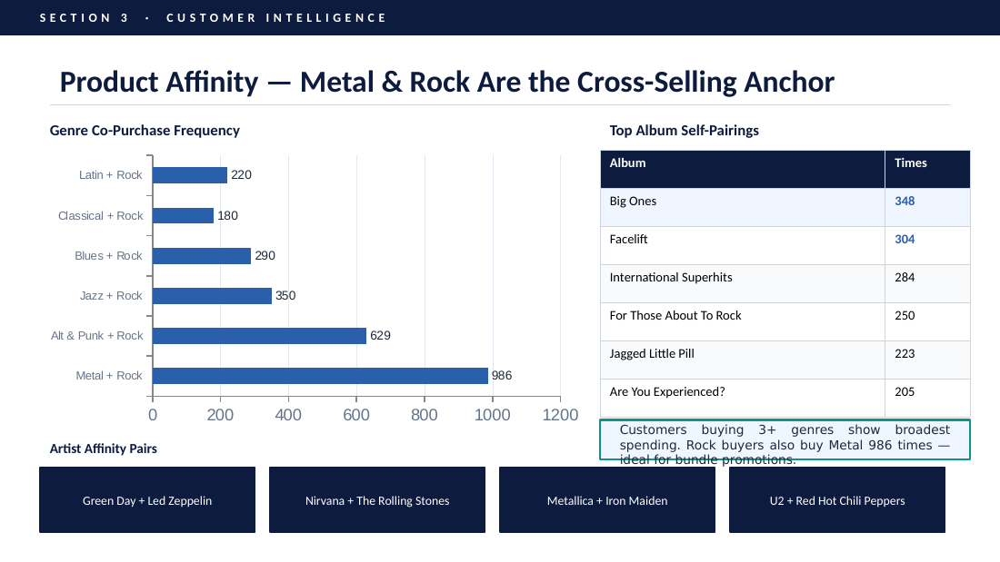
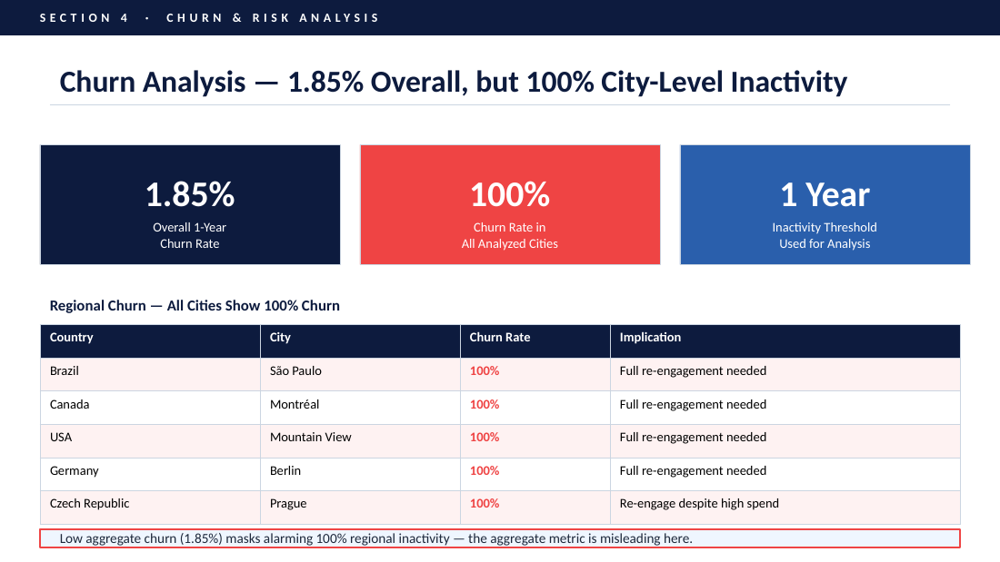
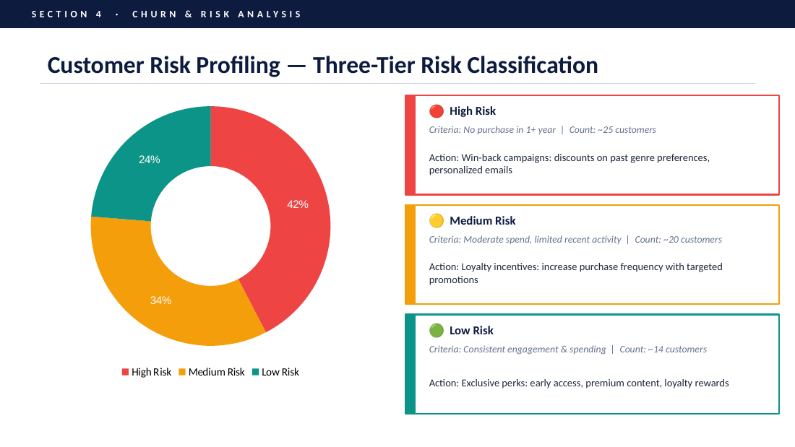

# Chinook Music Records: Strategic Analysis of the Physical Music Market

An SQL data analytics project that turns sales data into recommendations for growing Chinook's physical music business.

---

## Overview

This project analyzes the **Chinook Music Records** database using SQL (MySQL) to generate data-driven recommendations for the physical music market. The analysis is built around three pillars:

1. **Understanding the Market**: which genres, artists, and tracks lead sales
2. **Knowing the Customer**: who the high-value customers are and how they behave
3. **Shaping the Strategy**: which customers are at risk of churning and what actions to take

**Central question:** *How can Chinook leverage its sales data to drive growth and refine its market strategy?*

---

## Repository Structure

```
├── chinook_database.sql        # MySQL database file
├── chinook_analysis_query.sql  # All analysis queries
├── Chinook_analysis_doc.docx   # Detailed analysis document
├── Chinook_analysis_ppt.ppt    # Presentation of findings
├── images/                     # Slide screenshots used in this README
└── README.md
```

---

## Dataset and Schema

The data comes from the **Chinook SQL database**. The analysis uses 8 tables:

`Customer` · `Invoice` · `InvoiceLine` · `Track` · `Album` · `Artist` · `Genre` · `Employee`

An **ERD (Entity Relationship Diagram)** was created before writing any joins to map the relationships between these tables.



---

## Data Cleaning and Preprocessing

| Table | Affected Columns | Resolution |
|-------|------------------|------------|
| Customer | company, state, postal_code, phone, fax | `COALESCE()` → default text |
| Employee | reports_to | `COALESCE()` → 'Not Available' |
| Track | composer, milliseconds | `COALESCE()` → default values |

**No records were deleted.** Every null was handled to preserve data integrity for downstream analysis.

---

## Tools and SQL Techniques

- **MySQL** (database and query execution)
- Multi-table **JOINs** (including `LEFT JOIN`)
- **CTEs** (Common Table Expressions)
- **Aggregations** (`SUM`, `COUNT`, `MAX`)
- **Window functions**: `RANK()`, `ROW_NUMBER()`
- **Null handling** with `COALESCE()`

---

## Methodology

1. Built an ERD to understand table relationships.
2. Joined all 8 tables to connect sales, customer, and product data.
3. Used CTEs and window functions to:
   - Rank the top customers by revenue per country
   - Identify top-selling genres, artists, and tracks
4. Segmented customers by country, genre preference, and purchase behavior.
5. Used a `LEFT JOIN` with `MAX(invoice_date)` to flag inactive customers, applying:
   - a **1-year churn threshold**
   - a **3-month inactivity threshold** for risk profiling
6. Summarized the results in a PowerPoint deck with strategic recommendations.

---

## Key Findings

### Rock dominates the USA market
Rock drives over **50% of USA genre revenue** (about $826 of total sales), well ahead of Metal and Alternative & Punk.



### Revenue by geography
The USA and Czech Republic lead in revenue. Prague is the top city by revenue.



### Purchase activity declined from 2017 to 2020
Year-wise analysis shows a clear downward trend in purchases, and no new customers were acquired. The average order value is about **$9.77**.



### Metal + Rock is the strongest cross-sell pair
**986 co-purchases** of Metal and Rock make it the highest-affinity genre pair, which opens the door to bundling and upselling.



### Churn: the overall number hides the real risk
The overall churn rate is just **1.85%**, but a city-level breakdown showed **100% churn** in several key cities, including **Prague, São Paulo, and Mountain View**.



### Customer risk profiling
Customers were grouped into three risk tiers, each with its own re-engagement action.



### Other findings
- The **top 5 customers per country** contribute a disproportionate share of regional revenue.
- The dataset contained **zero new customers acquired**, so the entire base is long-term buyers.

---

## Challenges and Solutions

| Challenge | Solution |
|-----------|----------|
| The aggregate churn rate (1.85%) hid serious regional risk | Built a granular **city-level churn query** to surface high-risk cities |
| No new customers in the dataset, so there was no acquisition cohort to compare against | Adjusted the segmentation logic to focus on long-term customer behavior |

---

## Recommendations

1. **Promote top-performing albums** to capitalize on proven demand.
2. **Launch risk-tier re-engagement campaigns** targeting high-churn cities and inactive customers.
3. **Build genre-based bundles**, starting with Metal + Rock, based on cross-sell patterns.

---

## Learnings

- Strengthened SQL skills in joins, CTEs, and window functions for ranking and segmentation.
- **Aggregate metrics can hide serious regional risk**, so drilling down is essential.

---

## Future Scope

- Enrich the dataset with **customer age and gender** for more precise targeting.
- Build a **live CLV (Customer Lifetime Value) dashboard** to track spending and purchase frequency over time.

---

## How to Use

1. Clone the repository:
```bash
   git clone https://github.com/nipparajput/chinook-music-store-sql-analysis.git
```
2. Open **MySQL Workbench** (or any MySQL client) and run `chinook_database.sql` to create the database.
3. Run the queries in `chinook_analysis_query.sql` to reproduce the analysis.
4. Open `Chinook_analysis_ppt.ppt` for a visual summary and `Chinook_analysis_doc.docx` for the full explanation.

---

## Author

**Nippa**
[LinkedIn](https://www.linkedin.com/in/nippa)
